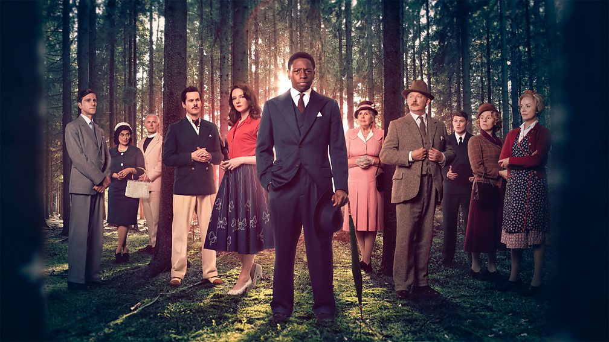

# 2024 01 Январь

## Mr Bates vs The Post Office

One of the greatest miscarriages of justice in British legal history where hundreds of innocent sub-postmasters and postmistresses were wrongly accused of theft, fraud and false accounting due to a defective IT system.

[https://www.imdb.com/title/tt27867155/](https://www.imdb.com/title/tt27867155/)

[https://en.wikipedia.org/wiki/Mr_Bates_vs_The_Post_Office](https://en.wikipedia.org/wiki/Mr_Bates_vs_The_Post_Office)

[https://www.bbc.com/news/entertainment-arts-67861886](https://www.bbc.com/news/entertainment-arts-67861886)

[https://www.itv.com/watch/mr-bates-vs-the-post-office-the-real-story/10a1798/10a1798a0001](https://www.itv.com/watch/mr-bates-vs-the-post-office-the-real-story/10a1798/10a1798a0001)

## Murder Is Easy (TV series)

One death is a tragedy – are four deaths a crime? Nothing is what is seems in a deceptively sleepy English village. A star-studded cast in a gripping Agatha Christie classic.

[https://www.bbc.co.uk/programmes/m001tw5s](https://www.bbc.co.uk/programmes/m001tw5s)

[https://en.wikipedia.org/wiki/Murder_Is_Easy_(TV_series)](https://en.wikipedia.org/wiki/Murder_Is_Easy_(TV_series))

[https://www.imdb.com/title/tt26771826/](https://www.imdb.com/title/tt26771826/)

