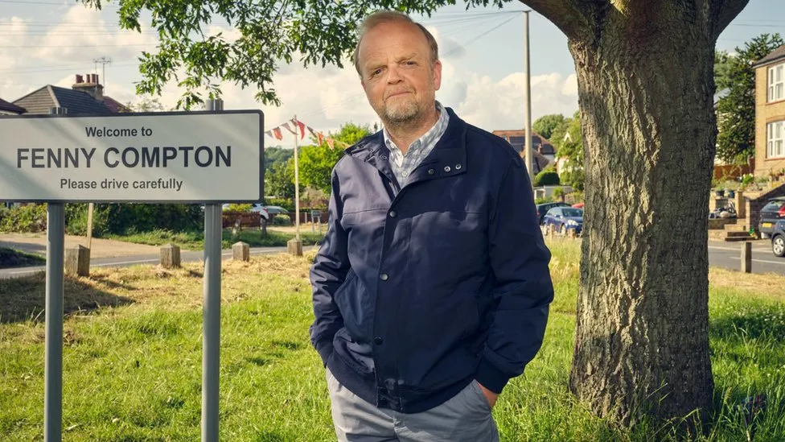

[andrewalevin.github.io/movies/](https://andrewalevin.github.io/movies/)

[github.com/andrewalevin/andrewalevin.github.io/edit/main/movies/index.md](https://github.com/andrewalevin/andrewalevin.github.io/edit/main/movies/index.md)

# 2024 01 Январь

## True Detective (season 4)

When the long winter night falls in Ennis, Alaska, the eight men who operate the Tsalal Arctic Research Station vanish without a trace. To solve the case, Detectives Liz Danvers (Jodie Foster) and Evangeline Navarro (Kali Reis) will have to confront the darkness they carry in themselves, and dig into the haunted truths that lie buried under the eternal ice.

Credits: Showrunner, writer, director, executive producer, Issa López; star and executive producer, Jodie Foster. Executive Producers: Barry Jenkins, Adele Romanski, and Mark Ceryak for PASTEL; Mari Jo Winkler; Chris Mundy; Alan Page Arriaga; Steve Golin; Richard Brown; Woody Harrelson; Matthew McConaughey; Cary Joji Fukunaga; Nic Pizzolatto. Producers: Princess Daazhraii Johnson; Cathy Tagnak Rexford; Sam Breckman.

[https://en.wikipedia.org/wiki/True_Detective_(season_4)](https://en.wikipedia.org/wiki/True_Detective_(season_4))

[https://www.hbo.com/true-detective](https://www.hbo.com/true-detective)

<iframe width="560" height="315" src="https://www.youtube.com/embed/WkL7cpG2UhE?si=eU7snLNqXKieGx-A" title="YouTube video player" frameborder="0" allow="accelerometer; autoplay; clipboard-write; encrypted-media; gyroscope; picture-in-picture; web-share" allowfullscreen></iframe>

## Mr Bates vs The Post Office

One of the greatest miscarriages of justice in British legal history where hundreds of innocent sub-postmasters and postmistresses were wrongly accused of theft, fraud and false accounting due to a defective IT system.

[https://www.imdb.com/title/tt27867155/](https://www.imdb.com/title/tt27867155/)

[https://en.wikipedia.org/wiki/Mr_Bates_vs_The_Post_Office](https://en.wikipedia.org/wiki/Mr_Bates_vs_The_Post_Office)

[https://www.bbc.com/news/entertainment-arts-67861886](https://www.bbc.com/news/entertainment-arts-67861886)

[https://www.itv.com/watch/mr-bates-vs-the-post-office-the-real-story/10a1798/10a1798a0001](https://www.itv.com/watch/mr-bates-vs-the-post-office-the-real-story/10a1798/10a1798a0001)

## Murder Is Easy (TV series)

One death is a tragedy – are four deaths a crime? Nothing is what is seems in a deceptively sleepy English village. A star-studded cast in a gripping Agatha Christie classic.

[https://www.bbc.co.uk/programmes/m001tw5s](https://www.bbc.co.uk/programmes/m001tw5s)

[https://en.wikipedia.org/wiki/Murder_Is_Easy_(TV_series)](https://en.wikipedia.org/wiki/Murder_Is_Easy_(TV_series))

[https://www.imdb.com/title/tt26771826/](https://www.imdb.com/title/tt26771826/)

