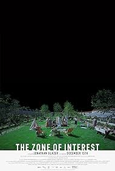
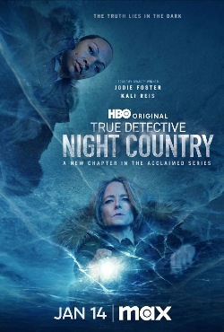
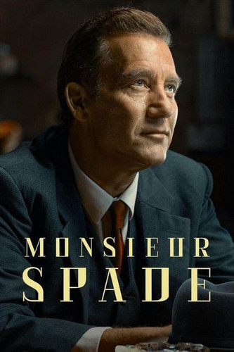
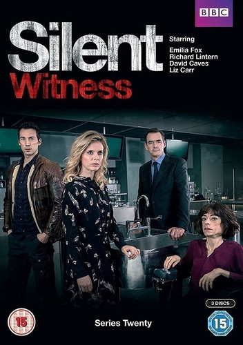
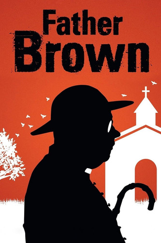
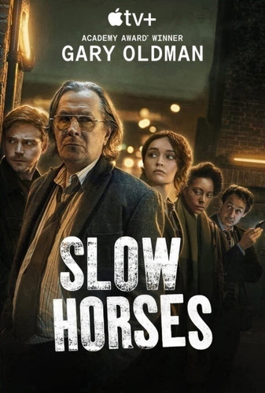
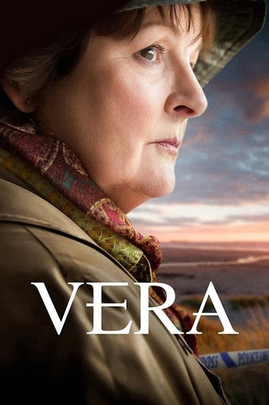
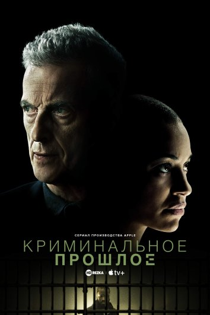
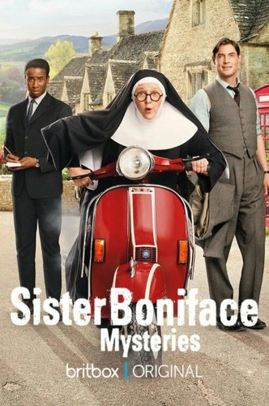
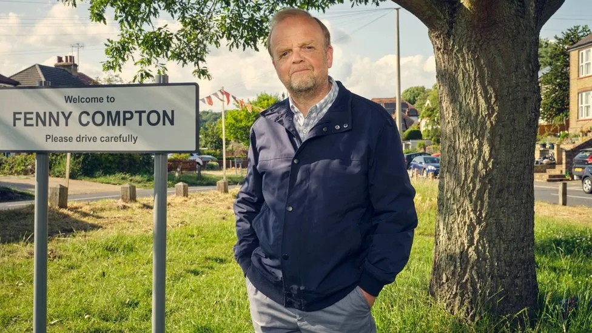

[andrewalevin.github.io/movies/](https://andrewalevin.github.io/movies/)

[github.com/andrewalevin/andrewalevin.github.io/edit/main/movies/index.md](https://github.com/andrewalevin/andrewalevin.github.io/edit/main/movies/index.md)

# 2024 01 Январь

## The Zone of Interest (film)

[https://en.wikipedia.org/wiki/The_Zone_of_Interest_(film)](https://en.wikipedia.org/wiki/The_Zone_of_Interest_(film))

[https://a24films.com/films/the-zone-of-interest](https://a24films.com/films/the-zone-of-interest)

<iframe width="560" height="315" src="https://www.youtube.com/embed/GFNtVaAuVYY?si=bYfV2ZGDHegrbjjM" title="YouTube video player" frameborder="0" allow="accelerometer; autoplay; clipboard-write; encrypted-media; gyroscope; picture-in-picture; web-share" allowfullscreen></iframe>

## True Detective (season 4)

When the long winter night falls in Ennis, Alaska, the eight men who operate the Tsalal Arctic Research Station vanish without a trace. To solve the case, Detectives Liz Danvers (Jodie Foster) and Evangeline Navarro (Kali Reis) will have to confront the darkness they carry in themselves, and dig into the haunted truths that lie buried under the eternal ice.

Credits: Showrunner, writer, director, executive producer, Issa López; star and executive producer, Jodie Foster. Executive Producers: Barry Jenkins, Adele Romanski, and Mark Ceryak for PASTEL; Mari Jo Winkler; Chris Mundy; Alan Page Arriaga; Steve Golin; Richard Brown; Woody Harrelson; Matthew McConaughey; Cary Joji Fukunaga; Nic Pizzolatto. Producers: Princess Daazhraii Johnson; Cathy Tagnak Rexford; Sam Breckman.

[https://en.wikipedia.org/wiki/True_Detective_(season_4)](https://en.wikipedia.org/wiki/True_Detective_(season_4))

[https://www.hbo.com/true-detective](https://www.hbo.com/true-detective)

<iframe width="560" height="315" src="https://www.youtube.com/embed/WkL7cpG2UhE?si=eU7snLNqXKieGx-A" title="YouTube video player" frameborder="0" allow="accelerometer; autoplay; clipboard-write; encrypted-media; gyroscope; picture-in-picture; web-share" allowfullscreen></iframe>

## Шпионский залив

## Месье Спейд 1 сезон - Monsieur Spade

1963-й год. Легендарный сыщик Сэм Спейд завершил профессиональную карьеру и наслаждается свободой в живописном регионе Франции, ведя мирную, спокойную и беззаботную жизнь. Счастливый отдых Сэма неожиданно заканчивается, когда шестеро беззащитных монахинь становятся жертвами жестокого убийцы. Пока жители провинциального городка скорбят, Спейд приступает к расследованию и выясняет, что убийства монахинь могут быть связаны с таинственным подростком, который, по слухам, обладает могущественными способностями… 

- Дата выхода: 	15 января 2024 года

-  IMDb: 7.3 (775) Кинопоиск: 7.55 (3 732) 

[http://kinopub.me/series/drama/65517-mese-speyd-2024.html](http://kinopub.me/series/drama/65517-mese-speyd-2024.html)

## Безмолвный свидетель 27 сезон - Silent Witness

Благодаря скрупулезной работе судмедэксперта команде английских полицейских удается распутывать самые сложные преступления… 

-  IMDb: 7.9 (12 128) Кинопоиск: 7.04 (1 544)
-  Дата выхода: 	21 февраля 1996 года

[http://kinopub.me/series/drama/41832-bezmolvnyy-svidetel-1996.html](http://kinopub.me/series/drama/41832-bezmolvnyy-svidetel-1996.html)

## Отец Браун 11 сезон

Сюжет сосредоточен вокруг католического священника Брауна, который несет службу в Церкви святой Марии в небольшой британской деревне Котсуолд. Глубокие познания человеческой души и проницательность позволяют ему взять на себя обязательства детектива, который занимается выслеживанием преступников, руководствуясь интуицией и жизненным опытом. Вести расследования святому отцу помогают секретарь Бриджит Маккарти, жена богатого землевладельца Фелисия Монтегю, ее племянница Пенелопа Уиндермир, а также шофер Сид Картер. 

[http://kinopub.me/series/drama/2122-otec-braun-2013.html](http://kinopub.me/series/drama/2122-otec-braun-2013.html)

## Медленные лошади 3 сезон

Ривер Картрайт — молодой и амбициозный агент МИ-5, который с треском проваливает учебную миссию, в результате чего переводится в Слау-Хаус. Парень оказывается в компании таких же неудачников как он, которые по той или иной причине были причислены к «медленным лошадям», сотрудникам британской разведки, утратившим доверие. Возглавляет отдел саркастичный и ворчливый Джексон Лэмб, сожалеющий о своей угасшей карьере. Вынужденный выполнять скучную бумажную работу, главный герой неожиданно вовлекается в опасное задание и получает шанс реабилитировать весь отдел. 

-  IMDb: 8.0 (52 315) Кинопоиск: 7.57 (13 426)
-  Дата выхода: 	1 апреля 2022 года
- Страна: 	США, Великобритания

[http://kinopub.me/series/thriller/47752-medlennye-loshadi-2022.html](http://kinopub.me/series/thriller/47752-medlennye-loshadi-2022.html)

## Vera

Сюжет полицейской кинодрамы «Вера» основывается на серии известных трудов Энн Кливес.
В центре повествования находится Вера Стенхоуп — женщина, занимающая должность старшего инспектора в отделе криминальной полиции выдуманного британского городка. Дамочка среднего возраста весьма самостоятельная особа, которая практически помешана на работе и полностью подчиняется собственным, известным ей одной демонам. Когда героине одиноко, об этом никто не узнает, потому как она примет воинственный облик с лукавинкой во взгляде. Напарником барышни является Джо Эшуорт — проверенный временем с железной выдержкой коллега. На пару герои занимаются расследованием дел различной запутанности, принимаясь за каждый случай с самозабвением, компетентностью и самоотдачей, спрашивая то же и от своих подчинённых. Каждый отдельный случай женщина крайне близко принимает к сердцу и для неё главное непросто вычислить и поймать законопреступника, но и понять причины, подвигшие человека преступить черту дозволенного. Экстравагантные манеры, открытость и напористость героини, вызывают неоднозначную реакцию у людей. Тем не менее женщина-инспектор умеет правильно расставлять приоритеты и во всех ситуациях добивается поставленной цели, умело контролируя всё происходящее в родном городке. 

- IMDb: 8.1 (18 366) Кинопоиск: 7.39 (2 750
- Дата выхода: 	30 апреля 2011 года
- Страна: 	Великобритания

[http://kinopub.me/series/drama/22585-vera-2011.html](http://kinopub.me/series/drama/22585-vera-2011.html)

## Криминальное прошлое - Criminal Record / The Challenge

В лондонскую полицию поступает анонимный телефонный звонок, где напуганный женский голос сообщает, что ее бойфренд много лет назад совершил убийство своей бывшей девушки, но вместо него наказание отбывает совершенно другой мужчина. За расследование берется молодой детектив Джун Ленкер, которая проверяет списки заключенных и выясняет, что речь идет об Эрроле Матисе. Женщина стремится докопаться до правды, что приводит к противостоянию с опытным детективом Дэниелом Хегарти, который более десяти лет назад отвечал за расследование того убийства. 

- Рейтинги: 	IMDb: 7.3 (1 365)

- Дата выхода: 	9 января 2024 года

[http://kinopub.me/series/drama/65513-kriminalnoe-proshloe-2024.html](http://kinopub.me/series/drama/65513-kriminalnoe-proshloe-2024.html)

<iframe width="560" height="315" src="https://www.youtube.com/embed/G_sohSQWHvg?si=tDC87XkwDq73lVUp" title="YouTube video player" frameborder="0" allow="accelerometer; autoplay; clipboard-write; encrypted-media; gyroscope; picture-in-picture; web-share" allowfullscreen></iframe>

## Расследование сестры Бонифации (Sister Boniface Mysteries)

http://kinopub.me/series/drama/47405-rassledovanie-sestry-bonifacii-2022.html

<iframe width="560" height="315" src="https://www.youtube.com/embed/Rw8Reh_sR8o?si=NJ8-A7H4WseM1ymZ" title="YouTube video player" frameborder="0" allow="accelerometer; autoplay; clipboard-write; encrypted-media; gyroscope; picture-in-picture; web-share" allowfullscreen></iframe>

<iframe width="560" height="315" src="https://www.youtube.com/embed/SLefSk_YaXc?si=4fh-vCGHvF2Difaz" title="YouTube video player" frameborder="0" allow="accelerometer; autoplay; clipboard-write; encrypted-media; gyroscope; picture-in-picture; web-share" allowfullscreen></iframe>

## Mr Bates vs The Post Office

One of the greatest miscarriages of justice in British legal history where hundreds of innocent sub-postmasters and postmistresses were wrongly accused of theft, fraud and false accounting due to a defective IT system.

[https://www.imdb.com/title/tt27867155/](https://www.imdb.com/title/tt27867155/)

[https://en.wikipedia.org/wiki/Mr_Bates_vs_The_Post_Office](https://en.wikipedia.org/wiki/Mr_Bates_vs_The_Post_Office)

[https://www.bbc.com/news/entertainment-arts-67861886](https://www.bbc.com/news/entertainment-arts-67861886)

[https://www.itv.com/watch/mr-bates-vs-the-post-office-the-real-story/10a1798/10a1798a0001](https://www.itv.com/watch/mr-bates-vs-the-post-office-the-real-story/10a1798/10a1798a0001)

## Murder Is Easy (TV series)

One death is a tragedy – are four deaths a crime? Nothing is what is seems in a deceptively sleepy English village. A star-studded cast in a gripping Agatha Christie classic.

[https://www.bbc.co.uk/programmes/m001tw5s](https://www.bbc.co.uk/programmes/m001tw5s)

[https://en.wikipedia.org/wiki/Murder_Is_Easy_(TV_series)](https://en.wikipedia.org/wiki/Murder_Is_Easy_(TV_series))

[https://www.imdb.com/title/tt26771826/](https://www.imdb.com/title/tt26771826/)

